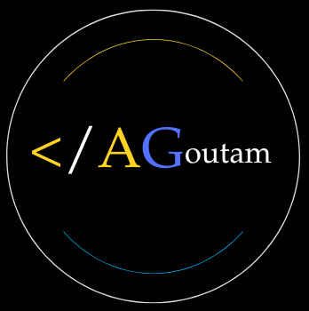

# Amritanshu Goutam - Personal Portfolio

<div align="center">
  
  <h3>Modern & Interactive Web Portfolio</h3>
</div>

## 🚀 Overview

This is a personal portfolio website built with modern web technologies to showcase my projects, skills, and professional experience. The site features a clean, responsive design with interactive elements and smooth animations.

## ✨ Features

- **Interactive UI** - Engaging user experience with animations and transitions
- **Responsive Design** - Optimized for all device sizes
- **Dark Theme** - Modern dark-themed interface with a professional color palette
- **Project Showcase** - Highlighted portfolio projects with descriptions
- **Contact Form** - Email integration using EmailJS
- **3D Elements** - Interactive tag cloud for skills visualization
- **Preloader Animation** - Smooth loading experience

## 🛠️ Technologies

- **React 19** - Latest React framework for building the UI
- **Vite** - Next-generation frontend tooling for fast development
- **Tailwind CSS** - Utility-first CSS framework for styling
- **Framer Motion** - Animation library for React
- **EmailJS** - Email service integration for contact form
- **React Icons** - Icon library for UI elements
- **React Parallax Tilt** - 3D tilt effect for interactive elements
- **TagCanvas** - Interactive 3D tag cloud

## 📋 Project Structure

```
├── public/               # Static files
├── src/                  # Source files
│   ├── assets/           # Images and static resources
│   ├── components/       # Reusable UI components
│   │   ├── Footer.jsx
│   │   ├── Navbar.jsx
│   │   ├── Preloader.jsx
│   │   └── SocialLinks.jsx
│   ├── section/          # Main page sections
│   │   ├── About.jsx     # About me section
│   │   ├── Contact.jsx   # Contact form section
│   │   ├── Home.jsx      # Landing page section
│   │   └── Projects.jsx  # Portfolio projects section
│   ├── App.jsx           # Main application component
│   ├── index.css         # Global styles
│   └── main.jsx          # Application entry point
└── index.html            # HTML entry point
```

## 🚀 Getting Started

### Prerequisites

- Node.js (v16 or higher)
- npm or yarn

## 📬 Contact

Amritanshu Goutam - [Contact through the website](https://amritanshuportfolio.vercel.app/)

---

<div align="center">
  <p>Built with ❤️ using React & Vite</p>
</div>
